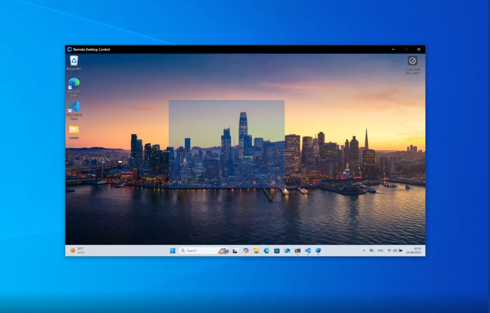

# Remote-Desktop-Control
### Remotely control a different desktop using python sockets

---

### features
- Listen to keyboard and mouse inputs from the `server` and transports them using the `TCP` protocol
- Streams screenshots from the `client` using the `UDP` protocol